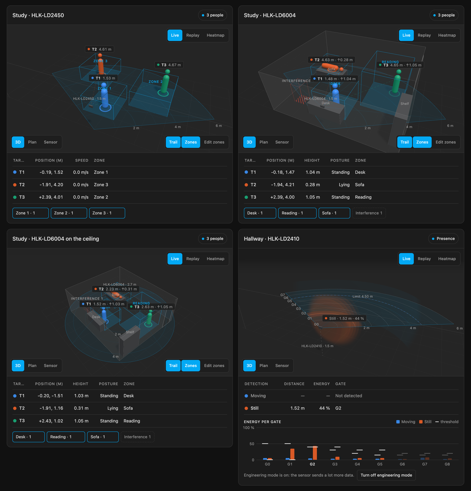
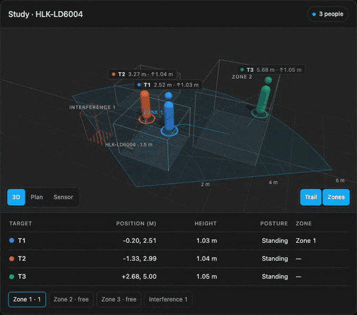

# mmWave 3D Card

[](https://github.com/hacs/integration)
[](https://github.com/dortizesquivel/mmwave-3d-card/releases)
[](https://github.com/dortizesquivel/mmwave-3d-card/actions/workflows/validate.yml)
[](LICENSE)

A Lovelace card that draws an mmWave presence radar in 3D: the sensor's coverage, its zones and every person it tracks, with a short trail behind each one. Built with [three.js](https://threejs.org/) and bundled into a single file, so it works without internet access.

It supports two Hi-Link radars:

- **HLK-LD2450**: 24 GHz, X/Y of up to 3 people, through the official ESPHome `ld2450` component.
- **HLK-LD6004**: 60 GHz, **X/Y/Z** of up to 3 people, through the [`esphome-ld6004`](https://github.com/javierconfoie/esphome-ld6004) external component. With Z the card also shows whether each person is standing, sitting or lying.





*Both images use the simulated data from the [demo](#development).*

> **Status: 0.1.0, early.** The LD2450 adapter follows the entity names from the ESPHome docs. The LD6004 adapter follows the external component's source and example YAML, but it has **not been tested with real hardware yet**: the sign of Z and the axes of the ceiling mode may need adjusting. Please open an issue with your readings if something looks off.

## Features

- Three views: **3D** (drag to orbit), **Plan** (top-down) and **Sensor** (what the radar sees). The view animates when you switch.
- **Wall or ceiling mounting.** The LD6004 can read it from its *Install Method* select.
- **Zones as boxes**, read from the sensor: they light up when someone is inside. LD2450 *Filter* zones and LD6004 interference zones show as excluded areas.
- **Height and posture** (LD6004): standing, sitting or lying, with thresholds you can tune.
- A small **table** with position, height or speed, and zone for each person, plus a chip per zone.
- **Follows the Home Assistant theme** (light, dark and custom themes), and the UI is in English or Spanish depending on the HA language.
- **Leaves dashboard scrolling alone**: one finger or the mouse wheel scrolls the page. To zoom, use Ctrl/⌘ + wheel, a trackpad pinch or two fingers.
- The rendering stops while the card is off screen, and the WebGL context is released when you leave the view.

## Requirements

- Home Assistant 2024.1 or newer.
- One of the supported sensors in ESPHome, with the entity names listed under [Entities the card reads](#entities-the-card-reads).

## Installation

### HACS (recommended)

1. Open **HACS** in Home Assistant.
2. Open the menu (⋮) in the top right → **Custom repositories**.
3. Add `https://github.com/dortizesquivel/mmwave-3d-card` with type **Dashboard**.
4. Search for **mmWave 3D Card** and select **Download**.
5. Reload the browser. HACS registers the dashboard resource for you (on dashboards managed from the UI).

### Manual

1. Download `mmwave-3d-card.js` from the [latest release](https://github.com/dortizesquivel/mmwave-3d-card/releases/latest).
2. Copy it to `/config/www/mmwave-3d-card.js`.
3. In **Settings → Dashboards → ⋮ → Resources**, add `/local/mmwave-3d-card.js` as a **JavaScript module**.
4. Reload the browser.

## Configuration

Add the card from the card picker (it appears as *mmWave 3D Card* and pre-fills the first sensor it finds) or in YAML.

LD2450 on a wall:

```yaml
type: custom:mmwave-3d-card
device: ld2450
prefix: kin_estudio_piscina      # sensor.kin_estudio_piscina_target_1_x → "kin_estudio_piscina"
title: Study
mount_height: 1.5
```

LD6004 on the ceiling, with named zones and tuned posture thresholds:

```yaml
type: custom:mmwave-3d-card
device: ld6004
prefix: radar_ld6004
title: Living room
mount: ceiling                   # or "auto" to follow the sensor's Install Method select
mount_height: 2.7
zone_names: [Sofa, Desk, Door]
posture:
  sitting: 0.9                   # height (m) below which a person counts as sitting
  lying: 0.4                     # height (m) below which a person counts as lying
```

### Options

| Option | Type | Default | Description |
|---|---|---|---|
| `type` | string | **required** | `custom:mmwave-3d-card` |
| `device` | string | **required** | `ld2450` or `ld6004` |
| `prefix` | string | **required** ¹ | The part of the entity ids before `_target_…`. For `sensor.kin_estudio_piscina_target_1_x` it is `kin_estudio_piscina`. |
| `title` | string | sensor model | Card title |
| `mount` | string | `wall` (LD2450), `auto` (LD6004) | `wall`, `ceiling` or `auto`. `auto` reads the LD6004 *Install Method* select (`Side`/`Top`) and falls back to `wall`. |
| `mount_height` | number | `1.5` | Sensor height above the floor, in metres |
| `max_range` | number | `6` | Maximum range drawn, in metres |
| `fov` | number | `120` | Opening angle, in degrees |
| `invert_x` | boolean | `false` | Mirrors the scene left to right, if people show up on the wrong side |
| `z_offset` | number | `mount_height` | Metres added to the LD6004's sensor-relative Z to get the height above the floor |
| `posture.sitting` | number | `0.95` | Height in metres below which a person counts as sitting |
| `posture.lying` | number | `0.45` | Height in metres below which a person counts as lying |
| `view` | string | `3d` | Initial view: `3d`, `plan` or `sensor` |
| `height` | number | `380` | Height of the 3D view, in pixels |
| `trail_seconds` | number | `8` | Length of each person's trail |
| `show_trail` | boolean | `true` | Trail visible at start (there is also a button) |
| `show_zones` | boolean | `true` | Zones visible at start (there is also a button) |
| `show_table` | boolean | `true` | Table and zone chips under the 3D view |
| `zone_names` | list | `Zone 1`, `Zone 2`… | Names for the detection zones, in order |
| `entities.targets` | list | — | Replaces single entities, per target: `[{ x, y, z, speed }, …]` |

¹ Not needed if you list every entity under `entities.targets`.

Example of `entities.targets`, for an ESPHome config with renamed entities:

```yaml
entities:
  targets:
    - { x: sensor.office_person_1_x, y: sensor.office_person_1_y }
    - { x: sensor.office_person_2_x, y: sensor.office_person_2_y }
```

### Entities the card reads

The card converts units from `unit_of_measurement` (mm, cm or m), so it also works if you change them in ESPHome.

**HLK-LD2450** ([ESPHome `ld2450`](https://esphome.io/components/sensor/ld2450.html)). It counts a target as absent when it reads X = 0 and Y = 0.

| Entity | Used for |
|---|---|
| `sensor.<prefix>_target_{1-3}_x`, `_y` | Position (mm) |
| `sensor.<prefix>_target_{1-3}_speed` | Speed (mm/s) |
| `number.<prefix>_zone_{1-3}_x1`, `_y1`, `_x2`, `_y2` | Zones (mm). All-zero zones are skipped. |
| `select.<prefix>_zone_type` | `Detection` or `Filter` (drawn as excluded); `Disabled` hides the zones |
| `sensor.<prefix>_zone_{1-3}_all_target_count` | Zone occupancy. If it is missing, the card works it out from the positions. |

**HLK-LD6004** ([`esphome-ld6004`](https://github.com/javierconfoie/esphome-ld6004)). It counts a target as absent when it reads `unknown` (the component publishes NaN).

| Entity | Used for |
|---|---|
| `sensor.<prefix>_target_{0-2}_x`, `_y`, `_z` | Position and height (m, Z relative to the sensor) |
| `sensor.<prefix>_detection_zones` | Detection zones (JSON text sensor, 3D boxes) |
| `sensor.<prefix>_interference_zones`, `_dwell_zones` | Interference zones (drawn as excluded) and dwell zones (dashed) |
| `binary_sensor.<prefix>_zone_{0-3}_presence` | Occupancy of each detection zone |
| `select.<prefix>_install_method` | `Side` / `Top`, for `mount: auto` |

### Coordinates

The sensor sits on the wall (or ceiling) at the origin. **x** is to the sensor's right, **y** points forward, out of the sensor, and **z** is height. The *Plan* view puts the sensor at the bottom, as if you were standing behind it. If your sensor reports x the other way round, set `invert_x: true`.

The LD6004 only reports a target's height, not its full shape. The card draws a 1.65 m figure for standing people and a shorter or lying figure based on the posture thresholds. The LD2450 has no Z, so its figures are always standing and only give scale.

## Choosing an HLK sensor

A summary of the research behind this card, for a wall-mounted sensor in a room with up to three people. The figures come from Hi-Link's product pages and the ESPHome components. I found no long-term reviews of the 60 GHz models at the time of writing.

### The Hi-Link family

| Module | Band | Reports | Home Assistant support | Notes |
|---|---|---|---|---|
| **LD2450** | 24 GHz | X, Y · 3 people | Official ESPHome component | The reference. Weak at detecting someone sitting still. |
| LD2460 / LD2461 | 24 GHz | X, Y · up to 5 people | Community | Still 2D. The LD2461 is [discontinued](https://www.espboards.dev/sensors/ld2461/). |
| LD2410 / 2412 / 2420 | 24 GHz | Distance only (1D) | Official | Very good for static presence, but they don't track people. |
| **[LD6004](https://www.hlktech.net/index.php?id=1391)** | 60 GHz | **X, Y, Z · 3 people** · 0–6 m · ±60° horizontal and vertical · wall or ceiling | [esphome-ld6004](https://github.com/javierconfoie/esphome-ld6004) (community) | **Best fit for 3D** |
| [LD6001](https://www.hlktech.net/index.php?id=1313) | 60 GHz | X, Y and vertical angle · up to 8 people · 8 m | [esphome-hlk-ld6001](https://github.com/Devristo/esphome-hlk-ld6001) (community) | Runner-up |
| LD6002B | 60 GHz | X, Y, Z and point cloud · 4 zones | Only a [standalone ESP-IDF firmware](https://github.com/christhomas/esp32c3-hlk-ld6002B-3d-human-presence-sensor), no ESPHome | No integration yet |
| LD6002 / LD6002C | 60 GHz | Breathing and heart rate (within 1.5 m) / falls | Standalone libraries | Single-purpose |
| LD6001A / LD6001C | 60 GHz | Trajectories from the ceiling / people counting at a doorway | Community | Different mounting |

Why 60 GHz helps with people who sit still: at 24 GHz the radar has 250 MHz of bandwidth, which limits range resolution to about 60 cm. At 60 GHz it has several GHz, so micro-movements such as breathing or typing are much easier to pick up. That is exactly where the LD2450 tends to lose someone sitting at a desk.

### LD6004 vs LD6001 in detail

| | **LD6004** | **LD6001** |
|---|---|---|
| Designed for | 3D presence at home, on a wall or ceiling | Smart air conditioners: on the wall, "looking" at the room |
| Chip | ADT6101P, 58–64 GHz | Not published, 60 GHz, 4 GHz sweep |
| Antennas | **2 transmit, 2 receive** | **4 transmit, 3 receive** |
| Reports | **X, Y, Z** per person, Doppler, track ID | X, Y, distance, horizontal angle and **vertical angle** |
| People | 3 | **8** |
| Range | 6 m on a wall | **8 m** |
| Field of view | ±60° horizontal, **±60° vertical** | ±60° horizontal, ±30° vertical |
| Published accuracy | 0.4 m in distance | Not published |
| Readings per second | ~10, pushed by the radar | ~5, polled by the ESP |
| Mounting | Wall or ceiling, selectable from HA | Wall at **2.2 m**, tilted about 10° |
| Power | 3.3 V, 135 to 600 mA. **Needs its own regulator.** | **5 V**, 1.1 W. The USB 5 V pin is enough. |
| UART | 3.3 V, connects directly to an ESP32 | **5 V**: needs a [level shifter](https://github.com/blinkenlights/polychrome/blob/main/docs/hlk_ld6001_reference.md) or it can damage the ESP32 |
| Size | 25 × 31.5 mm | 60 × 30 mm |
| Price (openelab, Oct 2026) | [about $14](https://openelab.com/products/hlk-ld6004-60g-radar-module-multi) | [€46](https://openelab.io/products/hi-link-60g-radar-sensor-module-ld6001) |

What that means in practice:

- **Telling two people apart when they are close: the LD6001 wins.** What counts is transmit × receive antennas: 4 × 3 = 12 virtual channels against 2 × 2 = 4. With three times as many channels, the LD6001 should separate two people on a sofa or at a desk better and make smaller angle errors.
- **Height: the LD6004 wins, but coarsely.** It reports Z directly. With only 4 channels shared between horizontal and vertical, that Z is good for telling standing, sitting and lying apart, not much more. The LD6001 has no height, but it reports the vertical angle, so a template sensor could compute Z from it and the distance. It might come out finer, but nobody has tested it, and the ±30° vertical opening misses part of the room if the sensor is mounted low.
- **Configuration from HA: the LD6004 wins.** Its ESPHome component offers:
  - **3D zones:** 4 detection zones as boxes with X, Y and Z limits, e.g. "desk chair, 0.8 to 1.3 m high".
  - **Interference and dwell zones.**
  - **Interference learning:** a button you press with the room empty, which records the fan or the curtain.
  - **A height filter:** a Z window that ignores anything below or above it.
  - **Tuning:** sensitivity, minimum trigger speed and hold time.

  The LD6001 component gives coordinates, per-zone counts and enter/leave events, but the radar only has 2 sensitivity levels and no adjustable range.
- **Mounting: the LD6004 wins.** It is small, runs on 3.3 V and goes on a wall or the ceiling at any reasonable height. The LD6001 wants to be at 2.2 m, is more than twice the size and needs its 5 V UART level-shifted.

What counts against each of them:

- **LD6004:** the ESPHome component came out in April 2026 and has a single author. It warns that on an ESP32-C3 the ~10 readings per second can bring Wi-Fi down unless you lower the output rate, so a dual-core ESP32 is a safer choice. It publishes coordinates in metres, and `NaN` instead of the LD2450's 0,0 when nobody is there (this card handles both).
- **LD6001:** Hi-Link does not publish its protocol, so the component depends on how its author reverse-engineered it. The repository's latest work is for the LD6001A (the ceiling model), not this one. It also costs three times as much.

**Verdict.** For a room with up to three people, a 3D view and zones by height: the **LD6004**. It is cheap, small, gives Z directly and is configurable from HA. The **LD6001** is only worth it if there are often more than three people, or if the LD2450 keeps merging two people sitting close together. You pay for that in price, mounting and a more fragile integration. The LD6004 is cheap enough to try side by side with an existing LD2450 for a few weeks before removing the old one; this card can show both on the same dashboard.

The antenna-count argument comes from radar theory, not from a measurement.

## Development

```bash
npm ci
npm test          # adapter and config tests (node:test)
npm run build     # bundles src/ and three.js into dist/mmwave-3d-card.js
npm run watch     # rebuilds on change, unminified with source maps
npm run demo      # serves the repo; open http://localhost:8766/demo/
```

The demo runs the built card against a simulated Home Assistant: three people walk around a room, one of them sits and lies down. It publishes the same entities as the two ESPHome components, for an LD2450 and an LD6004 on the wall and an LD6004 on the ceiling. URL parameters: `?theme=dark`, `?lang=es`, `?cards=ld2450,ld6004,ceiling`, `?view=plan`.

Layout:

- `src/adapters/`: one file per sensor, mapping its entities to a common model in metres. A new sensor is a new adapter.
- `src/scene.js`: the three.js scene.
- `src/mmwave-3d-card.js`: the custom element, table and HA lifecycle.

### Releasing

Releases are made by the [Release workflow](.github/workflows/release.yml), from **Actions → Release → Run workflow** or:

```bash
gh workflow run release.yml -f bump=patch     # patch | minor | major
gh workflow run release.yml -f bump=minor -f dry_run=true   # try it without publishing
```

It runs the tests, bumps the version in `package.json`, rebuilds `dist/`, adds the commits since the last tag to [`CHANGELOG.md`](CHANGELOG.md), commits, tags and publishes a GitHub release with `mmwave-3d-card.js` attached. HACS picks the new version up from there. With `prerelease`, HACS only offers it to users who enable beta versions.

`dist/` on `main` is only rebuilt by releases, so it can lag behind `src/` between them; use `npm run build` locally. Dependabot opens one grouped PR a month for npm and GitHub Actions updates.

## Roadmap

- Check the LD6004 axes, the sign of Z and the ceiling mode with real hardware.
- Visual editor for the card options.
- Several sensors in one scene, to compare them or to cover a large room.
- An LD6001 adapter if anyone uses it.

## License

[MIT](LICENSE). The bundled three.js is also MIT.
