# mmWave 3D Card

[](https://github.com/hacs/integration)
[](https://github.com/dortizesquivel/mmwave-3d-card/releases)
[](https://github.com/dortizesquivel/mmwave-3d-card/actions/workflows/validate.yml)
[](LICENSE)

A Lovelace card that draws an mmWave presence radar in 3D: the sensor's coverage, its zones and every person it tracks, with a short trail behind each one. Built with [three.js](https://threejs.org/) and bundled into a single file, so it works without internet access.

It supports three Hi-Link radars:

- **HLK-LD2450**: 24 GHz, X/Y of up to 3 people, through the official ESPHome `ld2450` component.
- **HLK-LD6004**: 60 GHz, **X/Y/Z** of up to 3 people, through the [`esphome-ld6004`](https://github.com/javierconfoie/esphome-ld6004) external component. With Z the card also shows whether each person is standing, sitting or lying.
- **HLK-LD2410** (B and C too): 24 GHz, **distance only**, through the official ESPHome `ld2410` component. The card draws each detection as a shell of the sensor's beam at its distance and charts the energy of each gate against its threshold, which is what you need to tune it.


*All images use the simulated data from the [demo](#development).*

> **Status: early.** The LD2450 adapter follows the entity names from the ESPHome docs. The LD6004 adapter follows the external component's source and example YAML, but it has **not been tested with real hardware yet**: the sign of Z and the axes of the ceiling mode may need adjusting. Please open an issue with your readings if something looks off.

**Contents:** [Sensor gallery](#sensor-gallery) · [Requirements](#requirements) · [Installation](#installation) · [Features](#features) · [Quick start](#quick-start) · [Using the card](#using-the-card) · [Configuration reference](#configuration-reference) · [Choosing an HLK sensor](#choosing-an-hlk-sensor) · [Development](#development)

## Sensor gallery

What the card looks like with each sensor it supports. Click a preview for a still of the whole card, with its table.

<table>
  <tr>
    <th>HLK-LD2450 on the wall</th>
    <th>HLK-LD6004 on the wall</th>
  </tr>
  <tr>
    <td><a href="docs/sensors/ld2450.png">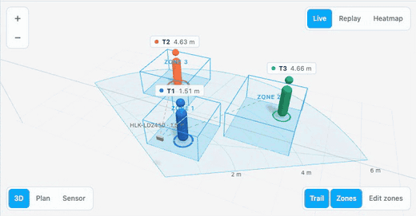</a></td>
    <td><a href="docs/sensors/ld6004-wall.png">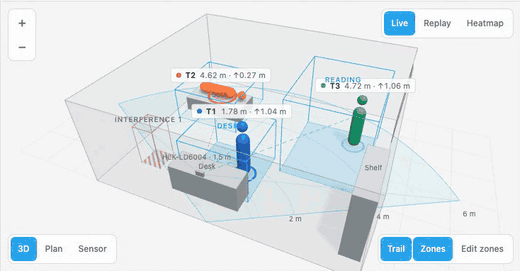</a></td>
  </tr>
  <tr>
    <td>X/Y of up to 3 people, their speed, and the sensor's zones.</td>
    <td>X/Y/Z: height and posture, interference and dwell zones.</td>
  </tr>
  <tr>
    <th>HLK-LD6004 on the ceiling</th>
    <th>HLK-LD2410 on the wall</th>
  </tr>
  <tr>
    <td><a href="docs/sensors/ld6004-ceiling.png">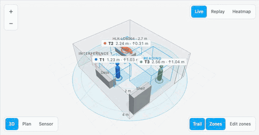</a></td>
    <td><a href="docs/sensors/ld2410.png">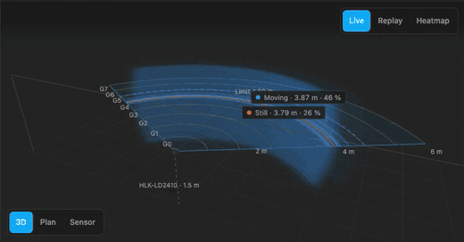</a></td>
  </tr>
  <tr>
    <td>The same sensor looking down: a round coverage under it.</td>
    <td>Distance only: shells of the beam, gates, and the energy per gate.</td>
  </tr>
</table>

## Requirements

- **Home Assistant 2024.11 or newer.**
- **[HACS](https://hacs.xyz/)**, to install and update the card from Home Assistant. Without it, [install the card manually](#manual).
- **The sensor in [ESPHome](https://esphome.io/)**, with the entity names the card looks for. The YAML [below](#setting-up-the-sensor-in-esphome) gives them those names.
- **A browser with WebGL 2**: any current browser and the Home Assistant apps. Very old wall tablets may lack it; the card then says so.
- **To edit zones**: an admin user and, on the LD6004, the zone services in its ESPHome YAML (included below).
- **For replay and heatmap**: the target sensors kept by the [recorder](https://www.home-assistant.io/integrations/recorder/). They are, unless you excluded them.

### Setting up the sensor in ESPHome

The card finds the entities from a **prefix**: the device's name the way Home Assistant writes it in entity ids. For `sensor.kin_estudio_piscina_target_1_x` the prefix is `kin_estudio_piscina`. Keep the entity names below so the ids end the way the card expects. If yours are named differently, point the card at them with [`entities.targets`](#options).

<details>
<summary><b>HLK-LD2450</b>, with the official <a href="https://esphome.io/components/sensor/ld2450/"><code>ld2450</code></a> component</summary>

```yaml
uart:
  id: uart_ld2450
  tx_pin: GPIO17               # your board's pins
  rx_pin: GPIO16
  baud_rate: 256000
  parity: NONE
  stop_bits: 1

ld2450:
  id: ld2450_radar
  uart_id: uart_ld2450

sensor:
  - platform: ld2450
    ld2450_id: ld2450_radar
    target_1:
      x: { name: Target-1 X }
      y: { name: Target-1 Y }
      speed: { name: Target-1 Speed }
    target_2:
      x: { name: Target-2 X }
      y: { name: Target-2 Y }
      speed: { name: Target-2 Speed }
    target_3:
      x: { name: Target-3 X }
      y: { name: Target-3 Y }
      speed: { name: Target-3 Speed }
    zone_1:
      target_count: { name: Zone-1 All Target Count }
    zone_2:
      target_count: { name: Zone-2 All Target Count }
    zone_3:
      target_count: { name: Zone-3 All Target Count }

number:
  - platform: ld2450
    ld2450_id: ld2450_radar
    zone_1:
      x1: { name: Zone-1 X1 }
      y1: { name: Zone-1 Y1 }
      x2: { name: Zone-1 X2 }
      y2: { name: Zone-1 Y2 }
    zone_2:
      x1: { name: Zone-2 X1 }
      y1: { name: Zone-2 Y1 }
      x2: { name: Zone-2 X2 }
      y2: { name: Zone-2 Y2 }
    zone_3:
      x1: { name: Zone-3 X1 }
      y1: { name: Zone-3 Y1 }
      x2: { name: Zone-3 X2 }
      y2: { name: Zone-3 Y2 }

select:
  - platform: ld2450
    ld2450_id: ld2450_radar
    zone_type: { name: Zone Type }
```

The zone counts are optional: without them the card works out occupancy from the positions. The zone numbers and *Zone Type* are what lets it draw and edit zones.

</details>

<details>
<summary><b>HLK-LD6004</b>, with the external <a href="https://github.com/javierconfoie/esphome-ld6004"><code>esphome-ld6004</code></a> component</summary>

Taken from the component's example YAML. The LD6004 draws up to 1 A at 3.3 V, so give it its own regulator ([why](#ld6004-vs-ld6001-in-detail)).

```yaml
external_components:
  - source:
      type: git
      url: https://github.com/javierconfoie/esphome-ld6004
      ref: main
    components: [hlk_ld6004]

uart:
  id: uart_ld6004
  tx_pin: GPIO21               # your board's pins
  rx_pin: GPIO20
  baud_rate: 115200

hlk_ld6004:
  id: ld6004
  uart_id: uart_ld6004

sensor:
  - platform: hlk_ld6004
    hlk_ld6004_id: ld6004
    target0_x: { name: Target 0 X }
    target0_y: { name: Target 0 Y }
    target0_z: { name: Target 0 Z }
    target1_x: { name: Target 1 X }
    target1_y: { name: Target 1 Y }
    target1_z: { name: Target 1 Z }
    target2_x: { name: Target 2 X }
    target2_y: { name: Target 2 Y }
    target2_z: { name: Target 2 Z }

binary_sensor:
  - platform: hlk_ld6004
    hlk_ld6004_id: ld6004
    zone0_presence: { name: Zone 0 Presence }
    zone1_presence: { name: Zone 1 Presence }
    zone2_presence: { name: Zone 2 Presence }
    zone3_presence: { name: Zone 3 Presence }

text_sensor:
  - platform: hlk_ld6004
    hlk_ld6004_id: ld6004
    detection_zones: { name: Detection Zones }
    interference_zones: { name: Interference Zones }
    dwell_zones: { name: Dwell Zones }

select:
  - platform: hlk_ld6004
    hlk_ld6004_id: ld6004
    install_method: { name: Install Method }

# Only needed to edit zones from the card. Add these to your existing api: block.
api:
  services:
    - service: set_detection_zone
      variables: { zone_index: int, x_min: float, x_max: float, y_min: float, y_max: float, z_min: float, z_max: float }
      then:
        - lambda: |-
            id(ld6004).send_set_detection_zone(zone_index, x_min, x_max, y_min, y_max, z_min, z_max);
    - service: set_interference_zone
      variables: { zone_index: int, x_min: float, x_max: float, y_min: float, y_max: float, z_min: float, z_max: float }
      then:
        - lambda: |-
            id(ld6004).send_set_interference_zone(zone_index, x_min, x_max, y_min, y_max, z_min, z_max);
    - service: set_dwell_zone
      variables: { zone_index: int, x_min: float, x_max: float, y_min: float, y_max: float, z_min: float, z_max: float }
      then:
        - lambda: |-
            id(ld6004).send_set_dwell_zone(zone_index, x_min, x_max, y_min, y_max, z_min, z_max);
```

In Home Assistant these become `esphome.<node>_set_detection_zone` and so on, where `<node>` is the ESPHome `name:` with dashes turned into underscores (`hlk-ld6004` → `hlk_ld6004`). The card finds them by itself when there is one LD6004; with several, set [`zone_service`](#options).

</details>

<details>
<summary><b>HLK-LD2410</b>, with the official <a href="https://esphome.io/components/sensor/ld2410/"><code>ld2410</code></a> component</summary>

```yaml
uart:
  id: uart_ld2410
  tx_pin: GPIO17               # your board's pins
  rx_pin: GPIO16
  baud_rate: 256000
  parity: NONE
  stop_bits: 1

ld2410:
  id: ld2410_radar
  uart_id: uart_ld2410

binary_sensor:
  - platform: ld2410
    ld2410_id: ld2410_radar
    has_target: { name: Presence }
    has_moving_target: { name: Moving Target }
    has_still_target: { name: Still Target }

sensor:
  - platform: ld2410
    ld2410_id: ld2410_radar
    moving_distance: { name: Moving Distance }
    still_distance: { name: Still Distance }
    moving_energy: { name: Move Energy }
    still_energy: { name: Still Energy }
    detection_distance: { name: Detection Distance }
    # Energy per gate, sent while Engineering mode is on. Repeat for g1 … g8.
    g0:
      move_energy: { name: G0 move energy }
      still_energy: { name: G0 still energy }

number:
  - platform: ld2410
    ld2410_id: ld2410_radar
    max_move_distance_gate: { name: Max move distance gate }
    max_still_distance_gate: { name: Max still distance gate }
    # Threshold per gate. Repeat for g1 … g8.
    g0:
      move_threshold: { name: G0 move threshold }
      still_threshold: { name: G0 still threshold }

select:
  - platform: ld2410
    ld2410_id: ld2410_radar
    distance_resolution: { name: Distance resolution }

switch:
  - platform: ld2410
    ld2410_id: ld2410_radar
    engineering_mode: { name: Engineering mode }
```

Only the distances and the moving/still targets are required. With the gate entities the card adds the energy chart; with *Engineering mode* it can switch the energies on and off from the card.

</details>

## Installation

### Via HACS (recommended)

[](https://my.home-assistant.io/redirect/hacs_repository/?owner=dortizesquivel&repository=mmwave-3d-card&category=plugin)

The button opens this repository in HACS on your own Home Assistant. If HACS doesn't have it yet, it offers to add it: confirm with type **Dashboard**, then select **Download**.

Or by hand:

1. In Home Assistant, open **HACS** from the sidebar.
2. Select the menu (⋮) at the top right → **Custom repositories**.
3. Paste `https://github.com/dortizesquivel/mmwave-3d-card` in **Repository**, choose **Dashboard** as the **Type** and select **Add**.
4. Close that dialog, search for **mmWave 3D Card**, open it and select **Download**.
5. Reload the browser, then add the card to a dashboard: see [Quick start](#quick-start).

HACS registers the card as a dashboard resource for you. If your dashboards are in YAML mode, add it yourself in `configuration.yaml`:

```yaml
lovelace:
  resources:
    - url: /hacsfiles/mmwave-3d-card/mmwave-3d-card.js
      type: module
```

**Updates:** new versions show up in HACS and under **Settings → Updates**. Install the update and reload the browser.

The card is waiting for review to join HACS's default list. Until it's accepted, it is added as a custom repository (steps 2 and 3 above).

### Manual

1. Download `mmwave-3d-card.js` from the [latest release](https://github.com/dortizesquivel/mmwave-3d-card/releases/latest).
2. Copy it to `/config/www/mmwave-3d-card.js`.
3. In **Settings → Dashboards → ⋮ → Resources**, add `/local/mmwave-3d-card.js` as a **JavaScript module**.
4. Reload the browser.

## Features

- **Three views**: 3D, plan and the sensor's own point of view. [More](#views)
- **People with height and posture**: with the LD6004, each figure is standing, sitting or lying. [More](#people-height-and-posture)
- **Visual editor** in the dashboard UI. [More](#visual-editor)
- **Your room**: walls, doors and furniture, so positions read against the real space. [More](#drawing-your-room)
- **Edit, draw and delete zones** on the floor, saved straight to the sensor; on the LD6004 that includes interference and dwell zones. [More](#editing-zones)
- **Tap a person or a zone** to open its more-info dialog. [More](#opening-an-entitys-details)
- **Replay** the last 1, 6 or 24 hours from the recorder. [More](#replay)
- **Heatmap** of where each person spent their time, in their colour. [More](#heatmap)
- **Zones from the sensor**, drawn as boxes: detection zones light up when someone is inside; zones the radar ignores (LD6004 interference, LD2450 *Filter*) are hatched; dwell zones have dashed edges.
- **Distance-only sensors (LD2410)**: each detection as a shell of the beam in 3D, rippling while the target moves and breathing while it's still; gate limits; and the energy of each gate against its threshold. [More](#distance-only-sensors-ld2410)
- **Wall or ceiling mounting**, and a **tilt** for wall sensors that point down; the LD6004 can read the mounting from its *Install Method* select.
- **Follows the Home Assistant theme** (light, dark and custom themes); the UI is in English or Spanish, following HA's language.
- **Light on resources**: it stops drawing while off screen and releases its WebGL context when you leave the view. With reduced motion turned on in your system (no radar pulse), it also stops drawing when nothing moves.

## Quick start

Edit a dashboard, select **Add card** and search for **mmWave 3D Card**. The card fills in the first compatible sensor it finds; adjust the rest in the [visual editor](#visual-editor). In YAML, the minimum is the sensor model and the entity prefix:

```yaml
type: custom:mmwave-3d-card
device: ld2450
prefix: kin_estudio_piscina      # sensor.kin_estudio_piscina_target_1_x → "kin_estudio_piscina"
title: Study
mount_height: 1.5
```

An LD2410 in a hallway:

```yaml
type: custom:mmwave-3d-card
device: ld2410
prefix: esp32_pasillo            # sensor.esp32_pasillo_moving_distance → "esp32_pasillo"
title: Hallway
```

An LD6004 on the ceiling, with named zones and tuned posture thresholds:

```yaml
type: custom:mmwave-3d-card
device: ld6004
prefix: radar_ld6004
title: Living room
mount: ceiling                   # or "auto" to follow the sensor's Install Method select
mount_height: 2.7
zone_names: [Sofa, Desk, Door]
posture:
  sitting: 0.9                   # height (m) below which a person counts as sitting
  lying: 0.4                     # height (m) below which a person counts as lying
```

## Using the card

### Views

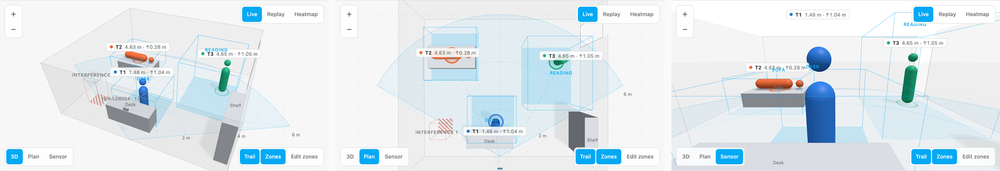

*The same moment in the 3D, plan and sensor views.*

Switch views with the buttons at the bottom left:

- **3D** orbits around the room when you drag.
- **Plan** looks straight down, with the sensor at the bottom, as if you stood behind it.
- **Sensor** looks out from the radar.

To zoom, use Ctrl/⌘ and the mouse wheel, pinch on a trackpad, or use two fingers on a touch screen. One finger or the wheel on its own keeps scrolling the dashboard. **Trail** and **Zones**, at the bottom right, show or hide each person's trail and the zones.

### People, height and posture

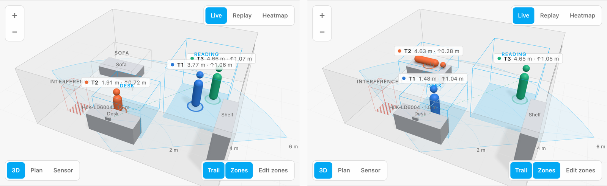

*LD6004: someone sitting at the desk (left) and, later, lying on the sofa (right).*

Each person gets a figure, a ring on the floor, a dashed line to the sensor and a label with their distance. The table under the view lists each person's position, speed (LD2450) or height and posture (LD6004), and the zone they are in; the chips under the table show how many people each zone holds.

With the LD6004 the figure follows the person's height: **standing**, **sitting** or **lying**. The card decides from the height above the floor, with thresholds you can change (`posture.sitting`, default 0.95 m, and `posture.lying`, default 0.45 m). The LD2450 has no height, so its figures are always standing and only give scale.

### Distance-only sensors (LD2410)

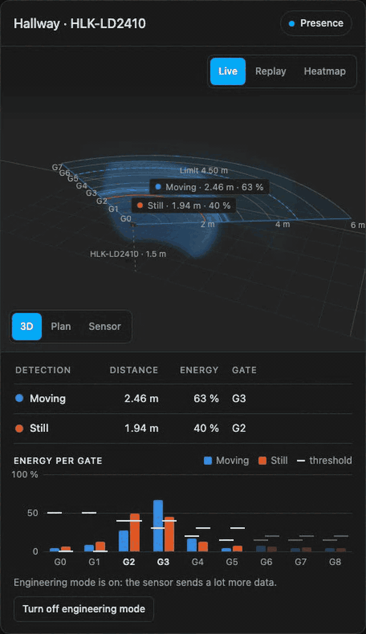

*An LD2410 in a hallway: someone still at 2 m, someone else walking away and back, the plan view, and the energy of each gate.*

The LD2410 only measures distance, so the card doesn't pretend to know where you are. Its beam is a cone of about ±60° (from Hi-Link's manual), so everything at a given distance lies on a **shell**, part of a sphere around the sensor, cut by the floor and the ceiling. That is how the 3D view draws each detection: a shell one gate thick (0.75 m or 0.2 m, depending on the sensor's resolution), blue for the moving target and orange for the still one, with a faint dome showing how far the sensor reaches.

The fan with the gates sits **at the sensor's height**, in the middle of the beam, where the radius is the measured distance as it is; a dashed line drops from the sensor to the floor. On it, each detection is a band and a bright arc, **G0 … G8** mark the gates, and the dashed arc is how far the sensor is set to look for movement and for still targets (its *max distance gates*). The plan view shows just this fan, from above.

The detections tell moving from still at a glance:

- **Moving**: crests run through the band and the shell the way the target is going, away from the sensor or towards it.
- **Still**: the band breathes, slowly fading in and out.
- **Both in the same gate**, which is common with a single person: the two **take turns**, blue and orange, instead of blending into a third colour.

A faint wave leaves the sensor every few seconds, as a shell in 3D and a ring in the plan view. With reduced motion turned on in your system, nothing moves: the moving band keeps its crests still and the still one stays solid.

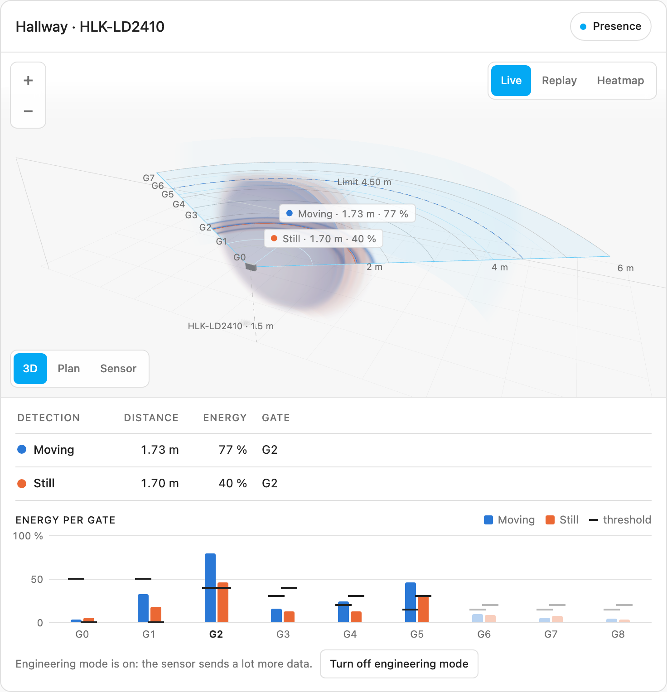

Under the table, **Energy per gate** shows, for each gate, the moving and still energy as bars and the threshold as a line across them. A bar above its line is what makes the sensor detect; gates beyond the limits are dimmed, and the gate with the current detection is in bold. The energies only arrive while the sensor's **Engineering mode** is on: if it's off, the chart shows the thresholds and, for admins, a button to switch it on (it makes the sensor send much more data, so switch it off when you're done tuning).

Replay works the same way, and the heatmap becomes rings: how long each distance was occupied, blue where most of it was movement and orange where it was someone still. There are no zones or trails on this sensor, so their buttons are hidden.

#### Tilted sensors

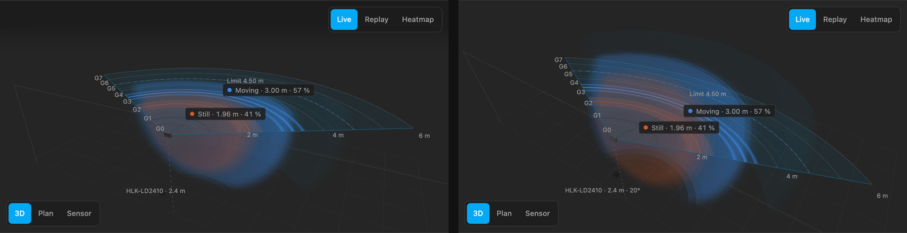

*An LD2410 2.4 m up, near the ceiling: level (left) and tilted 20° down (right, `mount_height: 2.4`, `tilt: 20`).*

High on a wall the sensor usually points down. Set `tilt` to the angle of its axis below the horizontal and the card turns the whole beam with it: the cone and its shells, the faint dome, the scan wave, and the fan with the gates, which stays the beam's middle plane, sloping towards the floor. A detection stays at its measured distance from the sensor. The 3D camera turns with the fan, so it still looks at it from above, and the sensor's label shows the tilt.

On the LD2450 the tilt only turns the drawing of the sensor: it measures range and horizontal angle, and tilting it down doesn't change either, so its X/Y stay as they are. The LD6004's points aren't turned yet; that will come once it can be checked against the real sensor.

### Visual editor

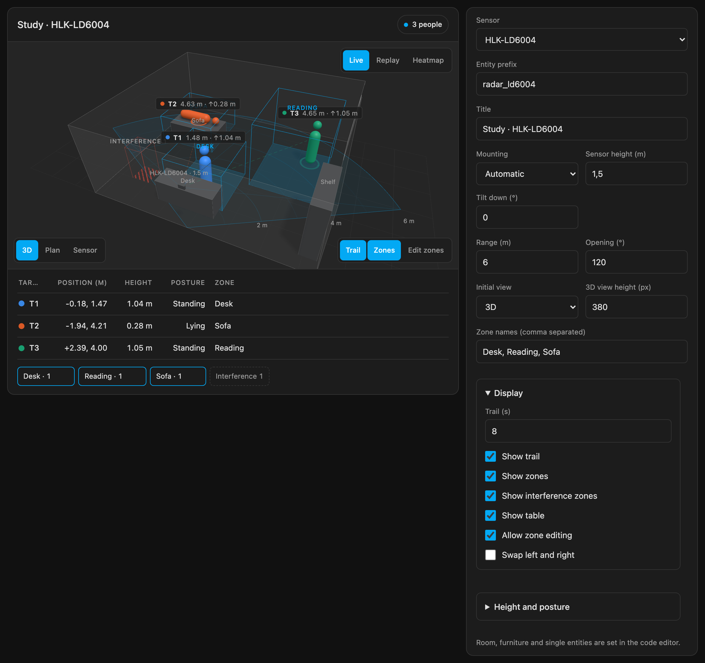

*The editor next to the card it edits. This capture comes from the demo, which uses the card's own fallback form; inside Home Assistant the same fields use HA's form controls.*

The editor covers the sensor and its prefix (with the sensors it finds on your system), mounting, range and opening, the initial view, zone names, what to show, and, for the LD6004, posture thresholds and the zone service. The room and single-entity overrides stay in YAML: open the code editor for those.

### Drawing your room

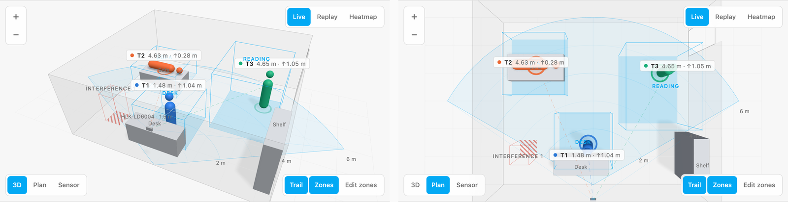

*A room with walls, a door on the right and three pieces of furniture, in 3D and in plan.*

Describe the room under `room:` and the card draws it around the radar. Coordinates are in metres, in the same frame as the sensor: x to its right, y forward (for a ceiling sensor, from the point under it). Walls are the corners of the floor outline, in order; a door is a stretch of wall drawn as an opening; each piece of furniture is a box with a name. Someone lying on a sofa or a bed rests on top of it.

```yaml
room:
  wall_height: 2.4                 # default 2.4 m
  walls: [[-3.2, 0], [3.4, 0], [3.4, 5.8], [-3.2, 5.8]]
  doors:
    - { from: [3.4, 4.6], to: [3.4, 5.5] }
  furniture:
    - { name: Desk, x: [-1.3, 0.5], y: [0.55, 1.15], height: 0.75 }
    - { name: Sofa, x: [-2.9, -1.0], y: [3.7, 4.6], height: 0.45 }
    - { name: Shelf, x: [2.9, 3.35], y: [0.4, 1.9], height: 1.8 }
```

A quick way to get the numbers: stand in each corner the radar can see for a few seconds and read your position in the card's table.

### Editing zones

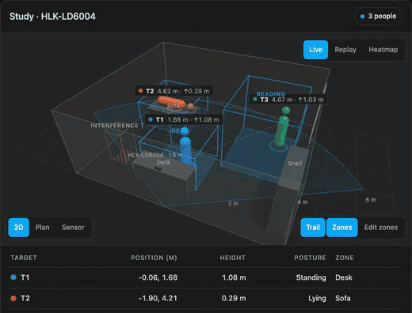

*Resizing the desk zone, moving the reading zone, then drawing an interference zone and deleting it.*

1. Select **Edit zones**, at the bottom right. It only appears for admin users. The card switches to the plan view, shows every zone (including the ones `show_interference: false` hides) and puts a handle on each corner of the zones it can change. Each kind keeps its colour.
2. Drag a corner to resize a zone, or drag inside a zone to move it. The label shows its size as you go.
3. Let go: the change is saved to the sensor. The zone keeps the shape you gave it until the sensor reports it back; if that takes more than 8 seconds, the card says so and draws what the sensor has.
4. To add a zone, select **Add zone**. On the LD6004, first pick its kind: **Detection**, **Interference** or **Dwell** (a kind whose four slots are taken shows *(full)*). Then drag on the floor to draw it, or tap to drop a 1 × 1 m square. **Cancel** leaves without adding anything. The zone goes into the first free slot of its kind.
5. To remove a zone, tap it and select **Delete zone**. It is cleared on the sensor, not just hidden.
6. Select **Done** to go back to the view you had.

How each sensor stores them:

- **LD2450**: three zones, written to `number.<prefix>_zone_N_x1 … y2` with `number.set_value`, in each entity's unit and within its limits. The three share one kind, set on the device with *Zone Type* (*Detection* or *Filter*), so new zones take that kind.
- **LD6004**: four zones of each kind, written with the services in the component's example YAML: `esphome.<node>_set_detection_zone`, `_set_interference_zone` and `_set_dwell_zone`. Each zone keeps its height limits; new zones go from the floor to 2.2 m. Zones snap to 10 cm, because the component reports them with one decimal. With one LD6004 the card finds the services by itself; with several, set `zone_service`. A kind whose service isn't in your ESPHome YAML can't be added or changed.

Set `allow_zone_editing: false` to hide the button.

### Opening an entity's details

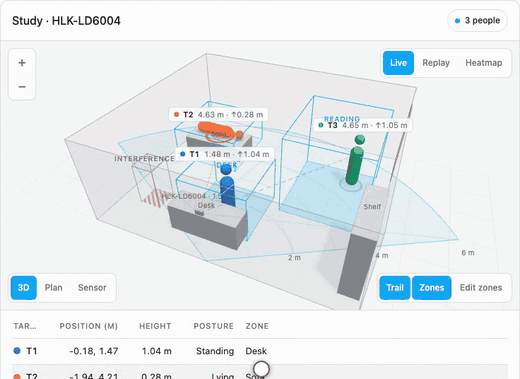

*Tapping a person, then a zone chip. The demo shows which entity would open; in Home Assistant it's the more-info dialog.*

Tap a person to open the more-info dialog of their X entity, with its history. Tapping a zone, or its chip under the table, opens its occupancy entity (the zone's count or presence sensor), so you can see when it was occupied. Rows in the table work the same way.

### Replay

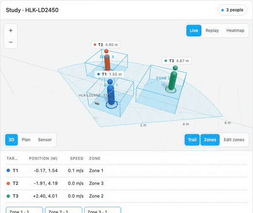

*Replaying the last hour at ×60, then jumping ahead with the slider.*

1. Select **Replay**, at the top right.
2. Choose how far back to go: **1 h**, **6 h** or **24 h**.
3. Select **Play** and pick the speed: **×1**, **×10** or **×60**. Drag the slider to jump to any moment; the time shows next to it.
4. Select **Live** to go back to the current readings.

The people, the table and the zone chips show the chosen moment; zones themselves are drawn as they are now. The card reads the target entities with HA's `history/history_during_period`. An LD2450 publishing once a second stores about 86,000 states per entity a day, so 24 hours takes a few seconds to load.

### Heatmap

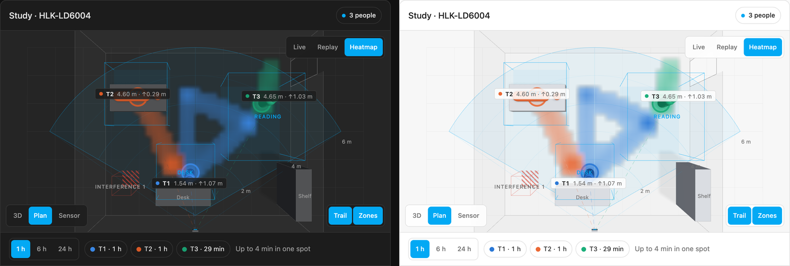

*Time spent at each spot over the last hour, coloured by person, in the dark and light themes.*

Select **Heatmap** and a period. The card adds up how long each person was detected on each 20 cm patch of floor. Each patch takes the colour of whoever spent the most time there, the same colour as their figure, and the more time, the more solid it looks.

The chips under the view give each person's total time; tap one to hide or show that person, for example to see only where T2 has been. Next to them, the longest time spent in a single spot. Live people keep moving on top. The plan view reads best.

T1, T2 and T3 are the radar's tracking slots, not identities: when people come and go, the radar can hand a slot to someone else, so over an hour "T1" may be more than one person.

## Configuration reference

### Options

| Option | Type | Default | Description |
|---|---|---|---|
| `type` | string | **required** | `custom:mmwave-3d-card` |
| `device` | string | **required** | `ld2450`, `ld6004` or `ld2410` |
| `prefix` | string | **required** ¹ | The part of the entity ids before `_target_…`. For `sensor.kin_estudio_piscina_target_1_x` it is `kin_estudio_piscina`. |
| `title` | string | sensor model | Card title |
| `mount` | string | `wall` (LD2450), `auto` (LD6004) | `wall`, `ceiling` or `auto`. `auto` reads the LD6004 *Install Method* select (`Side`/`Top`) and falls back to `wall`. |
| `mount_height` | number | `1.5` | Sensor height above the floor, in metres |
| `tilt` | number | `0` | Wall sensors: how far the sensor points down, in degrees below the horizontal (0 = level, 90 = straight down). Turns the drawing of the sensor and, on the LD2410, its whole beam. [More](#tilted-sensors) |
| `max_range` | number | `6` | Maximum range drawn, in metres |
| `fov` | number | `120` | Opening angle, in degrees |
| `invert_x` | boolean | `false` | Mirrors the scene left to right, if people show up on the wrong side |
| `z_offset` | number | `mount_height` | Metres added to the LD6004's sensor-relative Z to get the height above the floor |
| `posture.sitting` | number | `0.95` | Height in metres below which a person counts as sitting |
| `posture.lying` | number | `0.45` | Height in metres below which a person counts as lying |
| `view` | string | `3d` | Initial view: `3d`, `plan` or `sensor` |
| `height` | number | `380` | Height of the 3D view, in pixels |
| `trail_seconds` | number | `8` | Length of each person's trail |
| `show_trail` | boolean | `true` | Trail visible at start (there is also a button) |
| `show_zones` | boolean | `true` | Zones visible at start (there is also a button) |
| `show_table` | boolean | `true` | Table and zone chips under the 3D view |
| `show_interference` | boolean | `true` | Show the zones the radar ignores: LD6004 interference zones and LD2450 *Filter* zones |
| `zone_names` | list | `Zone 1`, `Zone 2`… | Names for the detection zones, in order |
| `room` | object | — | Walls, doors and furniture to draw, see [Drawing your room](#drawing-your-room) |
| `allow_zone_editing` | boolean | `true` | Show the *Edit zones* button (it only appears for admin users) |
| `zone_service` | string | found automatically | LD6004 only: one of the sensor's zone services, e.g. `esphome.hlk_ld6004_set_detection_zone`; the card finds the interference and dwell services from it. Needed when there is more than one LD6004. |
| `entities.targets` | list | — | Replaces single entities, per target: `[{ x, y, z, speed }, …]` |

¹ Not needed if you list every entity under `entities.targets`.

Example of `entities.targets`, for an ESPHome config with renamed entities:

```yaml
entities:
  targets:
    - { x: sensor.office_person_1_x, y: sensor.office_person_1_y }
    - { x: sensor.office_person_2_x, y: sensor.office_person_2_y }
```

### Entities the card reads

The card converts units from `unit_of_measurement` (mm, cm or m), so it also works if you change them in ESPHome.

**HLK-LD2450** ([ESPHome `ld2450`](https://esphome.io/components/sensor/ld2450.html)). It counts a target as absent when it reads X = 0 and Y = 0.

| Entity | Used for |
|---|---|
| `sensor.<prefix>_target_{1-3}_x`, `_y` | Position (mm) |
| `sensor.<prefix>_target_{1-3}_speed` | Speed (mm/s) |
| `number.<prefix>_zone_{1-3}_x1`, `_y1`, `_x2`, `_y2` | Zones (mm). All-zero zones are skipped. |
| `select.<prefix>_zone_type` | `Detection`, or `Filter` (hatched, shown as *Excluded N*); `Disabled` hides the zones |
| `sensor.<prefix>_zone_{1-3}_all_target_count` | Zone occupancy. If it is missing, the card works it out from the positions. |

**HLK-LD6004** ([`esphome-ld6004`](https://github.com/javierconfoie/esphome-ld6004)). It counts a target as absent when it reads `unknown` (the component publishes NaN).

| Entity | Used for |
|---|---|
| `sensor.<prefix>_target_{0-2}_x`, `_y`, `_z` | Position and height (m, Z relative to the sensor) |
| `sensor.<prefix>_detection_zones` | Detection zones (JSON text sensor, 3D boxes) |
| `sensor.<prefix>_interference_zones`, `_dwell_zones` | Interference zones (hatched) and dwell zones (dashed edges) |
| `binary_sensor.<prefix>_zone_{0-3}_presence` | Occupancy of each detection zone |
| `select.<prefix>_install_method` | `Side` / `Top`, for `mount: auto` |

**HLK-LD2410** ([ESPHome `ld2410`](https://esphome.io/components/sensor/ld2410/)). Distances in cm; a target counts as present when its binary sensor is on (the distances keep their last value).

| Entity | Used for |
|---|---|
| `sensor.<prefix>_moving_distance`, `_still_distance` | Distance of the moving and the still target |
| `sensor.<prefix>_move_energy`, `_still_energy` | Their energy |
| `binary_sensor.<prefix>_moving_target`, `_still_target`, `_presence` | Whether each is detected, and presence |
| `select.<prefix>_distance_resolution` | Gate size: `0.75m` or `0.2m` |
| `number.<prefix>_max_move_distance_gate`, `_max_still_distance_gate` | How far it looks, in gates |
| `sensor.<prefix>_gN_move_energy`, `_gN_still_energy`; `number.<prefix>_gN_move_threshold`, `_gN_still_threshold` | Energy and threshold per gate (N = 0 … 8) |
| `switch.<prefix>_engineering_mode` | Sends the gate energies while on |

### Coordinates

The sensor sits on the wall (or ceiling) at the origin. **x** is to the sensor's right, **y** points forward, out of the sensor, and **z** is height. The *Plan* view puts the sensor at the bottom, as if you were standing behind it. If your sensor reports x the other way round, set `invert_x: true`.

The LD6004 only reports a target's height, not its full shape. The card draws a 1.65 m figure for standing people and a shorter or lying figure based on the posture thresholds. The LD2450 has no Z, so its figures are always standing and only give scale.

## Choosing an HLK sensor

A summary of the research behind this card, for a wall-mounted sensor in a room with up to three people. The figures come from Hi-Link's product pages and the ESPHome components. I found no long-term reviews of the 60 GHz models at the time of writing.

### The Hi-Link family

| Module | Band | Reports | Home Assistant support | Notes |
|---|---|---|---|---|
| **LD2450** | 24 GHz | X, Y · 3 people | Official ESPHome component | The reference. Weak at detecting someone sitting still. |
| LD2460 / LD2461 | 24 GHz | X, Y · up to 5 people | Community | Still 2D. The LD2461 is [discontinued](https://www.espboards.dev/sensors/ld2461/). |
| **LD2410** | 24 GHz | Distance only (1D) | Official | **Supported** in distance mode. Very good for static presence, but it doesn't track people. |
| LD2412 / LD2420 | 24 GHz | Distance only (1D) | Official | Not supported yet. |
| **[LD6004](https://www.hlktech.net/index.php?id=1391)** | 60 GHz | **X, Y, Z · 3 people** · 0–6 m · ±60° horizontal and vertical · wall or ceiling | [esphome-ld6004](https://github.com/javierconfoie/esphome-ld6004) (community) | **Best fit for 3D** |
| [LD6001](https://www.hlktech.net/index.php?id=1313) | 60 GHz | X, Y and vertical angle · up to 8 people · 8 m | [esphome-hlk-ld6001](https://github.com/Devristo/esphome-hlk-ld6001) (community) | Runner-up |
| LD6002B | 60 GHz | X, Y, Z and point cloud · 4 zones | Only a [standalone ESP-IDF firmware](https://github.com/christhomas/esp32c3-hlk-ld6002B-3d-human-presence-sensor), no ESPHome | No integration yet |
| LD6002 / LD6002C | 60 GHz | Breathing and heart rate (within 1.5 m) / falls | Standalone libraries | Single-purpose |
| LD6001A / LD6001C | 60 GHz | Trajectories from the ceiling / people counting at a doorway | Community | Different mounting |

Why 60 GHz helps with people who sit still: at 24 GHz the radar has 250 MHz of bandwidth, which limits range resolution to about 60 cm. At 60 GHz it has several GHz, so micro-movements such as breathing or typing are much easier to pick up. That is exactly where the LD2450 tends to lose someone sitting at a desk.

### LD6004 vs LD6001 in detail

| | **LD6004** | **LD6001** |
|---|---|---|
| Designed for | 3D presence at home, on a wall or ceiling | Smart air conditioners: on the wall, "looking" at the room |
| Chip | ADT6101P, 58–64 GHz | Not published, 60 GHz, 4 GHz sweep |
| Antennas | **2 transmit, 2 receive** | **4 transmit, 3 receive** |
| Reports | **X, Y, Z** per person, Doppler, track ID | X, Y, distance, horizontal angle and **vertical angle** |
| People | 3 | **8** |
| Range | 6 m on a wall | **8 m** |
| Field of view | ±60° horizontal, **±60° vertical** | ±60° horizontal, ±30° vertical |
| Published accuracy | 0.4 m in distance | Not published |
| Readings per second | ~10, pushed by the radar | ~5, polled by the ESP |
| Mounting | Wall or ceiling, selectable from HA | Wall at **2.2 m**, tilted about 10° |
| Power | 3.3 V, 135 to 600 mA. **Needs its own regulator.** | **5 V**, 1.1 W. The USB 5 V pin is enough. |
| UART | 3.3 V, connects directly to an ESP32 | **5 V**: needs a [level shifter](https://github.com/blinkenlights/polychrome/blob/main/docs/hlk_ld6001_reference.md) or it can damage the ESP32 |
| Size | 25 × 31.5 mm | 60 × 30 mm |
| Price (openelab, Oct 2026) | [about $14](https://openelab.com/products/hlk-ld6004-60g-radar-module-multi) | [€46](https://openelab.io/products/hi-link-60g-radar-sensor-module-ld6001) |

What that means in practice:

- **Telling two people apart when they are close: the LD6001 wins.** What counts is transmit × receive antennas: 4 × 3 = 12 virtual channels against 2 × 2 = 4. With three times as many channels, the LD6001 should separate two people on a sofa or at a desk better and make smaller angle errors.
- **Height: the LD6004 wins, but coarsely.** It reports Z directly. With only 4 channels shared between horizontal and vertical, that Z is good for telling standing, sitting and lying apart, not much more. The LD6001 has no height, but it reports the vertical angle, so a template sensor could compute Z from it and the distance. It might come out finer, but nobody has tested it, and the ±30° vertical opening misses part of the room if the sensor is mounted low.
- **Configuration from HA: the LD6004 wins.** Its ESPHome component offers:
  - **3D zones:** 4 detection zones as boxes with X, Y and Z limits, e.g. "desk chair, 0.8 to 1.3 m high".
  - **Interference and dwell zones.**
  - **Interference learning:** a button you press with the room empty, which records the fan or the curtain.
  - **A height filter:** a Z window that ignores anything below or above it.
  - **Tuning:** sensitivity, minimum trigger speed and hold time.

  The LD6001 component gives coordinates, per-zone counts and enter/leave events, but the radar only has 2 sensitivity levels and no adjustable range.
- **Mounting: the LD6004 wins.** It is small, runs on 3.3 V and goes on a wall or the ceiling at any reasonable height. The LD6001 wants to be at 2.2 m, is more than twice the size and needs its 5 V UART level-shifted.

What counts against each of them:

- **LD6004:** the ESPHome component came out in April 2026 and has a single author. It warns that on an ESP32-C3 the ~10 readings per second can bring Wi-Fi down unless you lower the output rate, so a dual-core ESP32 is a safer choice. It publishes coordinates in metres, and `NaN` instead of the LD2450's 0,0 when nobody is there (this card handles both).
- **LD6001:** Hi-Link does not publish its protocol, so the component depends on how its author reverse-engineered it. The repository's latest work is for the LD6001A (the ceiling model), not this one. It also costs three times as much.

**Verdict.** For a room with up to three people, a 3D view and zones by height: the **LD6004**. It is cheap, small, gives Z directly and is configurable from HA. The **LD6001** is only worth it if there are often more than three people, or if the LD2450 keeps merging two people sitting close together. You pay for that in price, mounting and a more fragile integration. The LD6004 is cheap enough to try side by side with an existing LD2450 for a few weeks before removing the old one; this card can show both on the same dashboard.

The antenna-count argument comes from radar theory, not from a measurement.

## Development

```bash
npm ci
npm test          # adapter and config tests (node:test)
npm run build     # bundles src/ and three.js into dist/mmwave-3d-card.js
npm run watch     # rebuilds on change, unminified with source maps
npm run demo      # serves the repo; open http://localhost:8766/demo/
npm run docs:capture   # regenerates every README image and GIF from the demo (needs ffmpeg)
npm run docs:capture -- replay   # only the ones whose name contains "replay"
```

The demo runs the built card against a simulated Home Assistant: three people walk around a room, one of them sits and lies down. It publishes the same entities as the two ESPHome components, for an LD2450 and an LD6004 on the wall and an LD6004 on the ceiling. It also answers `callService` like the sensors would (so zone editing works) and `callWS` with simulated history. URL parameters: `?theme=dark`, `?lang=es`, `?cards=ld2450,ld6004,ceiling`, `?view=plan`, and for repeatable runs `seed`, `t` (scene time) and `frozen=1`.

### Browser tests

```bash
npx playwright install chromium   # once
npm run test:browser              # interaction tests; screenshot comparisons only run on Linux
```

[`test/browser/card.spec.js`](test/browser/card.spec.js) checks that the cards render without errors, that the views, tapping, zone dragging (for both sensors), replay, heatmap and the visual editor work, and compares four screenshots. WebGL runs on SwiftShader so the CI runner renders the same frame every time. The screenshot baselines live in `test/browser/__screenshots__` and are made on the CI's Linux runner, because fonts and software rendering differ between systems. After an intentional visual change, regenerate them with **Actions → Browser tests → Run workflow → update screenshots** (or `gh workflow run browser.yml -f update_screenshots=true`), which commits the new baselines.

Layout:

- `src/adapters/`: one file per sensor, mapping its entities to a common model in metres and writing zones back. A new sensor is a new adapter.
- `src/scene.js`: the three.js scene: room, zones and their editing, targets, heatmap layer, picking.
- `src/history.js`, `src/heatmap.js`: recorder history and time spent per floor cell.
- `src/editor.js`: the visual editor.
- `src/mmwave-3d-card.js`: the custom element, modes, table and HA lifecycle.

### Releasing

Releases are made by the [Release workflow](.github/workflows/release.yml), from **Actions → Release → Run workflow** or:

```bash
gh workflow run release.yml -f bump=patch     # patch | minor | major
gh workflow run release.yml -f bump=minor -f dry_run=true   # try it without publishing
```

It runs the tests, bumps the version in `package.json`, rebuilds `dist/`, adds the commits since the last tag to [`CHANGELOG.md`](CHANGELOG.md), commits, tags and publishes a GitHub release with `mmwave-3d-card.js` attached. HACS picks the new version up from there. With `prerelease`, HACS only offers it to users who enable beta versions.

`dist/` on `main` is only rebuilt by releases, so it can lag behind `src/` between them; use `npm run build` locally. Dependabot opens one grouped PR a month for npm and GitHub Actions updates.

## Roadmap

- Check the LD6004 axes, the sign of Z and the ceiling mode with real hardware.
- Several sensors in one scene, to compare them or to cover a large room.
- A "probable pet" rule for the LD6004: low targets outside the places where people lie down.
- Presets for commercial sensors built on the LD2450 (Everything Presence, Apollo MTR-1, Screek).
- An LD6001 adapter if anyone uses it.

## License

[MIT](LICENSE). The bundled three.js is also MIT.
